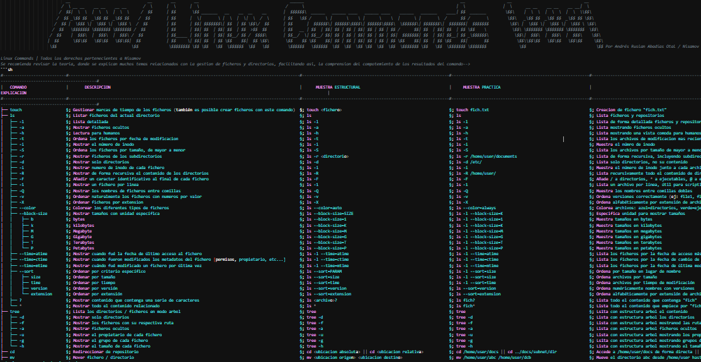

<!--
  _      _                     _____                                          _     
 | |    (_)                   / ____|                                        | |    
 | |     _ _ __  _   ___  __ | |     ___  _ __ ___  _ __ ___   __ _ _ __   __| |___ 
 | |    | | '_ \| | | \ \/ / | |    / _ \| '_ ` _ \| '_ ` _ \ / _` | '_ \ / _` / __|
 | |____| | | | | |_| |>  <  | |___| (_) | | | | | | | | | | | (_| | | | | (_| \__ \
 |______|_|_| |_|\__,_/_/\_\  \_____\___/|_| |_| |_|_| |_| |_|\__,_|_| |_|\__,_|___/
                                                                                    
Todos los derechos pertenecientes a Andrés Ruslan Abadías Otal | Nisamov: github.com/Nisamov
<style>
  body {
    font-family: 'Segoe UI', Tahoma, Geneva, Verdana, sans-serif;
    background-color: #2f3136;
    color: #ffffff;
    line-height: 1.6;
    margin: 0;
    padding: 0px;
  }
  .doc-container {
    max-width: 800px;
    margin: 20px auto;
    background-color: #36393f;
    padding: 40px;
    border-radius: 10px;
    box-shadow: 0 6px 18px rgba(0,0,0,0.5);
  }
  .doc-header {
    text-align: left;
    margin-bottom: 20px;
  }
  .doc-header div {
    padding: 5px 0;
    font-weight: bold;
  }
  .doc-header a {
    color: #a69be9ff;
    text-decoration: none;
  }
  .doc-header a:hover {
    text-decoration: underline;
  }
  .separator {
    border-top: 2px solid #bdcabbff;
    border-radius: 2px;
    margin: 10px 0 20px 0;
  }
  h1, h2, h3 {
    color: #00b0f4;
    margin-top: 30px;
  }
  p, li {
    color: #ffffff;
  }
  a {
    color: #00b0f4;
    text-decoration: none;
  }
  a:hover {
    text-decoration: underline;
    color: #00b0f4;
  }
</style>
</head>
<body>

<div class="doc-container">
  <div class="doc-header">
    <div>Andrés Ruslan Abadías Otal</div>
    <div>Página web: <a href="https://github.com/Nisamov">Github</a></div>
    <div>Repositorio: <a href="https://github.com/Theritex/LinuxCommands">Repositorio Origen</a></div>
    <div class="separator"></div>
  </div>
-->



# LinuxCommands | Comandos y Servicios

Este repositorio está basado en los apuntes personales del creador [Andrés Ruslan Abadías Otal](https://github.com/Nisamov) (15/07/2022).

> Linux Commands es un repositorio concebido para todas aquellas personas que desean aprender a realizar distintos servicios en sistemas Linux, así como para quienes buscan información detallada y específica sobre los contenidos disponibles en el propio repositorio.

El formato de comandos establecido en ficheros `commands.md`, está basado en el documento original `Documento de Origen.txt`.

### Estructura Árbol del Repositorio:
```sh
.
├── .github
│   └── media
│       └── img.png
├── access_control_lists
│   ├── commands.md
│   └── theory.md
├── backup_rsync
│   ├── commands.md
│   └── theory.md
├── combination_keys
│   └── combination.md
├── cron_tasks
│   ├── commands.md
│   └── theory.md
├── data_dump
│   ├── commands.md
│   └── theory.md
├── document_gestion
│   ├── commands.md
│   ├── compression.md
│   ├── main.md
│   └── theory.md
├── firewall_ufw
│   ├── commands.md
│   └── theory.md
├── iptables
│   ├── command-list.md
│   ├── commands.md
│   └── theory.md
├── permission_gestion
│   ├── permissions.md
│   └── theory.md
├── scripts
│   └── bash
│       ├── scripts_ejemplo
│       │   ├── echo.sh
│       │   └── for.sh
│       └── theory.md
├── secure_channel
│   ├── secure_channel_ftp
│   │   ├── commands.md
│   │   └── theory.md
│   └── secure_channel_ssh
│       ├── commands.md
│       └── theory.md
├── security
│   ├── backup
│   │   ├── commands.md
│   │   └── theory.md
│   ├── raid
│   │   ├── mount.md
│   │   └── process.sh
│   ├── audit.md
│   └── theory.md
├── services
│   ├── commands.md
│   └── theory.md
├── software_gestion
│   └── commands.md
├── system_data
│   ├── disk_partition
│   │   ├── commands.md
│   │   ├── theory.md
│   │   └── virtualdisk.md
│   ├── network_configuration
│   │   ├── dhcp_failover
│   │   │   ├── manual.md
│   │   │   ├── serv1_01-network-manager-all.yaml
│   │   │   ├── serv1_dhcpd.conf
│   │   │   ├── serv2_01-network-manager-all.yaml
│   │   │   ├── serv2_dhcpd.conf
│   │   │   └── servers_isc-dhcp-server
│   │   ├── dhcp_samba
│   │   │   ├── smb.conf
│   │   │   └── theroy.md
│   │   ├── interfaces_net
│   │   │   ├── dynamic-network.conf
│   │   │   ├── static-network.conf
│   │   │   └── theory.md
│   │   ├── netplan_net
│   │   │   ├── dynamic-network.conf
│   │   │   ├── static-network.conf
│   │   │   └── theory.md
│   │   ├── commands.md
│   │   └── theory.md
│   ├── system_data
│   │   ├── packet_install_theory.md
│   │   └── system_code.md
│   └── system_structure
│       └── linux-structure.md
├── users_permissions
│   ├── system_users.md
│   └── user_gestion.md
├── virtual_private_network_openvpn
│   └── commands.md
├── .gitignore
├── CONTRIBUTING.md
├── INFO.md
├── KEYWORD.md
├── LICENSE
├── README.md
└── SECURITY.md
```
<!--
</div>
-->